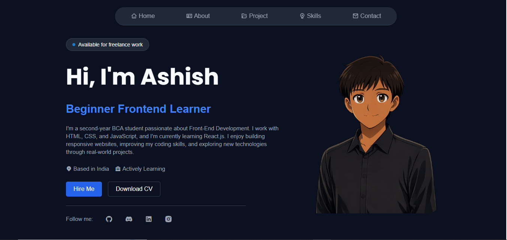

# 🌐 My Portfolio Website

A modern, responsive personal portfolio website showcasing my skills, projects, experience, and contact information. Built to create a strong online presence and demonstrate my web development expertise.

## 🚀 Live Demo

👉 https://ashishpal80.github.io/My_profile_web/

https://portfolioofaashish.netlify.app/

---


## 📸 Screenshots




---

## ✨ Features

- 📱 Fully Responsive Design
- 🎨 Modern & Clean UI
- 👨‍💻 About Me Section
- 💼 Projects Showcase
- 🛠 Skills Section
- 📞 Contact Information
- ⚡ Fast Loading
- 🌙 Easy to Customize

---

## 🛠 Tech Stack

- HTML5
- CSS3

---

## 📂 Project Structure

```
My_profile_web/
│
├── index.html
├── style.css
├── assets/images
└── README.md
```

---

## 💻 Getting Started

### Clone the repository

```bash
git clone https://github.com/AshishPal80/My_profile_web.git
```

### Navigate to project

```bash
cd My_profile_web
```

### Open

Simply open `index.html` in your browser.

Or use VS Code Live Server.

---

## 🎯 Customization

You can easily customize:

- Profile Information
- Skills
- Projects
- Social Links
- Contact Details
- Theme Colors
- Images

---

## 📬 Contact

**Ashish Pal**

- GitHub: https://github.com/AshishPal80
- LinkedIn :     https://www.linkedin.com/in/ashish-pal-635a02380
- Email: ashish1814pal@gmail.com

---

## ⭐ Support

If you like this project, please give it a ⭐ on GitHub.

---

## 📄 License

This project is licensed under the MIT License.

---

### Made with ❤️ by Ashish Pal